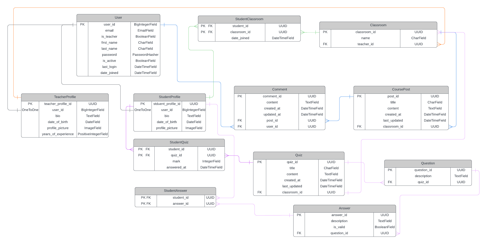

# QuizRoom Hub

QuizRoom Hub is a versatile educational platform designed to enhance online learning and classroom management. Inspired by Google Classroom, this API empowers users to register with distinct roles—either as teachers or students—allowing for a personalized experience tailored to their needs. Teachers can effortlessly create, update, and delete classrooms, and share courses and quizzes, fostering an engaging educational environment. Students can join these classrooms, participate in discussions, take quizzes, and receive instant feedback with their marks. Built with Python, Django, and Django Rest Framework, and leveraging a MySQL database.

## Table of Contents

- [Installation](#installation)
- [Usage](#usage)
- [Features](#features)
- [Role Management and Permissions](#role-management-and-permissions)
- [API Endpoints](#api-endpoints)
- [Database Schema](#database-schema)
- [Testing](#testing)
- [Contributing](#contributing)
- [License](#license)
- [Contact](#contact)

## Installation

### Prerequisites

- Python 3.x
- MySQL
- Django
- Django Rest Framework

### Steps

1. Clone the repository:
    ```bash
    git clone https://github.com/AyKrimino/QuizRoom-Hub.git
    cd QuizRoom-Hub
    ```

2. Create and activate a virtual environment:
    ```bash
    python -m venv venv 
    source venv/bin/activate   # On Windows use `venv\Scripts\activate`
    ```

3. Install the required packages:
    ```bash
    pip install -r requirements.txt
    ```

4. Create a `.env` file in the root directory and add the following environment variables:
    ```env
    SECRET_KEY=your_secret_key
    DATABASE_USER=your_database_user
    DATABASE_PASSWORD=your_database_password
    ```

5. Set up the MySQL database and update the `settings.py` file with your database configuration.

6. Apply the migrations:
    ```bash
    python manage.py migrate
    ```

7. Create a superuser:
    ```bash
    python manage.py createsuperuser
    ```

8. Run the development server:
    ```bash
    python manage.py runserver
    ```

## Usage

### Running the Development Server

1. Ensure your virtual environment is activated.
2. Run the development server:
    ```bash
    python manage.py runserver
    ```

### Accessing the Application

- Open your browser and go to `http://127.0.0.1:8000/`.

## Features

### Teachers

- Read and update their profiles.
- Create, read, update, and delete classrooms.
- Post courses and quizzes in their classrooms.
- Comment on their own posts.
- Delete any comment on their posts.

### Students

- Read and update their profiles.
- Join classrooms created by teachers.
- Read and comment on posts in the classrooms they have joined.
- Create, read, update, and delete their own comments.
- Take quizzes and receive marks.

## Role Management and Permissions

Role management and permissions are a crucial part of QuizRoom Hub. The platform uses JWT authentication, and all endpoints (except for registration and login) require an access token to access.

Each view is protected with specific permissions to ensure that only authorized users can perform certain actions. For example:
- Only authenticated teachers who own a classroom can delete it.
- Only authenticated students who are members in a classroom can view it
- Students can only update or delete their own comments on posts.
- Teachers can delete any comment on their own posts.

Detailed information about these permissions and role management can be found in the API schema documentation (Swagger UI or ReDoc).


## API Endpoints

For a comprehensive list of API endpoints and their details, please refer to the automatically generated API documentation:

- **Schema**: [http://127.0.0.1:8000/api/schema/](http://127.0.0.1:8000/api/schema/)
- **Swagger UI**: [http://127.0.0.1:8000/api/schema/swagger-ui/](http://127.0.0.1:8000/api/schema/swagger-ui/)
- **ReDoc**: [http://127.0.0.1:8000/api/schema/redoc/](http://127.0.0.1:8000/api/schema/redoc/)

These documentation tools provide a detailed and interactive interface for exploring the API endpoints, parameters, and request/response formats.

## Database Schema



## Testing

1. Ensure your virtual environment is activated.
2. Run the tests:
    ```bash
    python manage.py test
    ```

## Contributing

We welcome contributions to the QuizRoom Hub project.

## License
This project is licensed under the MIT License.

## Contact

For questions or feedback, please reach out to ayoub.krimi14@gmail.com or open an issue on GitHub.


